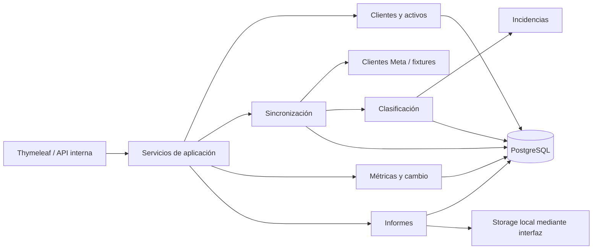

# Arquitectura

> Fase 2: `auth/user/role` implementan sesiones y RBAC; `client/branding/metaaccount` el catálogo e historiales; `audit` centraliza eventos; `filemanagement` abstrae logos externos. Controllers delegan en servicios/repositorios y Flyway es la autoridad del esquema. Véanse `SECURITY_MODEL.md`, `CLIENT_ASSET_MODEL.md` y ADR 0002.

## Estilo

Monolito modular Spring Boot 3.x/Java 21, desplegado como una aplicación y una base PostgreSQL 16. Cada módulo expone casos de uso a través de servicios; los controladores no acceden directamente a repositorios ni clientes Meta. Los límites se validarán con pruebas de arquitectura cuando existan módulos funcionales.

## Responsabilidades

- `auth`, `user`, `role`: sesión, credenciales, RBAC y bloqueo.
- `client`, `branding`: cliente, estado, logos, colores y preferencias.
- `metaaccount`: portafolios, cuentas, páginas, Instagram y asociaciones vigentes.
- `metaintegration`: WebClient, DTO externos, paginación, rate limit y fixtures; sin negocio.
- `synchronization`: orquestación idempotente, cursores, estados y errores.
- `campaign`, `adset`, `ad`: identidad y jerarquía externas normalizadas.
- `insight`, `organic`, `metric`: hechos pagados/orgánicos, acciones tipadas y cálculos.
- `classification`: resolución por señales priorizadas, sin confiar en request tenant-scoped.
- `incident`: revisión y resolución auditable.
- `exchangerate`: tasas por fecha/fuente y conversión BigDecimal.
- `report`, `excel`, `pdf`: snapshots y generadores sobre un modelo común.
- `filemanagement`: interfaz de storage, rutas seguras, checksum y retención.
- `audit`, `scheduling`, `configuration`, `shared`: preocupaciones transversales.

## Dependencias

Los módulos de dominio no dependen de web, Thymeleaf ni DTO Meta. `metaintegration` implementa puertos consumidos por `synchronization`. `report` consulta vistas/servicios de lectura y no recalcula reglas. `excel` y `pdf` dependen del modelo de reporte, nunca entre sí. Ningún módulo registra secretos ni expone entidades JPA directamente.

## Persistencia preliminar

PostgreSQL con Flyway. IDs internos independientes; IDs Meta en `VARCHAR`; dinero `NUMERIC(19,6)`; timestamps técnicos UTC; fechas de negocio `DATE`; payloads variables en JSONB con política de retención. Transacciones delimitan cada página normalizada o finalización de ejecución, evitando una transacción remota larga.

## Seguridad

- Sesión Spring Security, BCrypt, CSRF, cookies HttpOnly/SameSite y Secure en producción.
- Roles y permisos verificados en servicios además de rutas.
- Los IDs de cliente/activo se resuelven contra contexto autorizado; nunca se confía en IDs enviados.
- Secretos solo por variables/secret manager futuro; redacción de logs.
- Cargas con MIME/tamaño/dimensiones permitidos, nombre generado y prevención de traversal.
- Descargas autorizadas por cliente/rol; storage fuera de Git; auditoría de exportación y resolución.

## Pruebas

- Unitarias: calculadores, clasificación, prefijos, periodos y paths.
- Integración: repositorios/Flyway con Testcontainers PostgreSQL, sin H2.
- Contrato: DTO/fixtures Meta y paginación con WireMock o MockWebServer.
- Seguridad: CSRF, acceso por rol, aislamiento de activos y descargas.
- Generadores: golden datasets, inspección de celdas/PDF y reconciliación de totales.
- End-to-end del piloto: fixture -> clasificación -> incidencia -> informe.

## Almacenamiento

Puerto `FileStorage` con implementación local inicial bajo `APP_STORAGE_PATH/clients/{internal-id}/{yyyy}/{MM}/{type}`. La base guarda ruta relativa, MIME, tamaño y SHA-256. Escritura temporal + movimiento atómico; nombres no controlados por el usuario. Una implementación S3 futura conserva el mismo puerto.

## Observabilidad

Actuator expone únicamente health/info inicialmente. Cada sincronización lleva correlation ID, contadores, rango y estado; métricas posteriores medirán duración, errores, incidencias y antigüedad de datos sin etiquetas que filtren datos de clientes.
